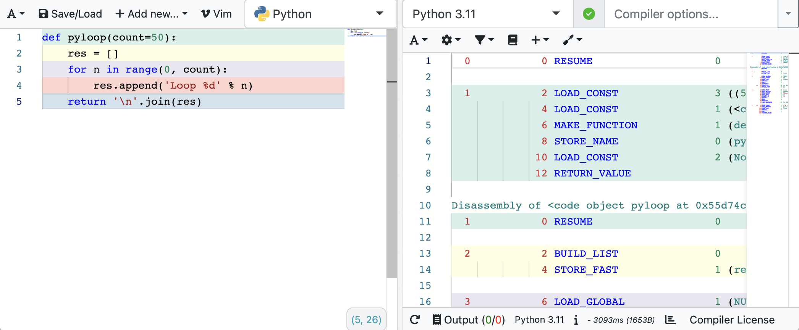

<div align="right"><i>By Quentin Rouvier, Philippe Cheype - Epitech Nice - 2023</i></div></br></br></br>
<div align="center">
<h1>Workshop Cython</br>Introduction and benchmarking</h1>
<a></a>
</div>

</br></br>

## Before starting

If you want to be present you need send an email to quentin.rouvier@epitech.eu with the following object:
```
[WSCYTHON] Nom Prénom
```
__/!\ Put your real firstname and lastname__

In the mail share a `.zip` or `.tar.gz` file with the contents of your repository.\
__/!\ Please run `python3 setup.py clean` before compressing your project__

Any work you do needs to be in the email, if you don't do this or didn't advance into the workshop at all you will be marked absent.

<br/><br/>

## Introduction

Cython is a language that makes writing C extensions for the Python language as easy as Python itself. In this workshop we will be using Cython to [benchmark](https://www.wikiwand.com/fr/Benchmark) two different algorithms coded in Python and C(ython).

<br/><br/>

## Setup

### Requirements

- [Python 3](https://www.python.org/downloads/)
  - Check if installed with: `python3 --version`
- [Cython](https://cython.org/#download)
  - Install with: `pip3 install cython`

<br/><br/>

## Ex01: Just Cython

You will find two simple alogrithms made with python. Our job today is to make them work in C(ython).

### Python

In the `demo/` folder you will find a file named [demo.py](demo/demo.py) with the following content:
```python
def pyloop():
    # ...

def pycount():
    # ...
```

### Cython

In the `demo/cython/` folder you will find a file named [demo.pyx](demo/cython/demo.pyx) with the following content:
```python
def cloop():
    # TODO: Fill this function

def ccount():
    # TODO: Fill this function
```

### Setup

To compile cython code to C/C++ you will use cythonise. It will create a library (`.so`, for those unfamiliar with that extension it's similar to a `.a` library like the `libmy.a` that you should all be familiar with).

To compile the code you will use the following command:
```bash
pip3 install -e .
```

__/!\ Make sure to keep any `__init__.py` files you see, they are empty but required for the setup.__

### Benchmark

In the current directory you will find the [bench.py](bench.py) file:
```python
import timeit

def main():
    # TODO: Fill this function

if __name__ == "__main__":
    main()
```

Using the timeit module call all 4 functions and print the results.

<br/><br/>

## Ex02: Cython and C/C++

In this exercise we will rewrite the `ccount()` function with a more C-like syntax, create a new function underneath named `betterccount()`:
```python
def betterccount():
    # TODO: Fill this function
```

Take a look at the documentation [here](https://cython.readthedocs.io/en/latest/src/userguide/language_basics.html).

__/!\ Make sure that you select `Cython` syntax and not `Pure Python` in the documentation. Those are two different approaches. Pure python is not necessary for our example.__
<div align="center"></div>

### Bemchmark

Let's go back to our [bench.py](bench.py) file. Add the new `betterccount()` function and compare the results.

<br/><br/>

## To go further

As a bonus if this subject interests you, you can look at the assembly code behind all this code.

Here is a website that will allow you to do that: [godbolt.org](https://godbolt.org/),

You can paste your code in the left editor and look at the assembly operation in the right editor, here is an example with the `pyloop()` function
<div align="center"></div>
